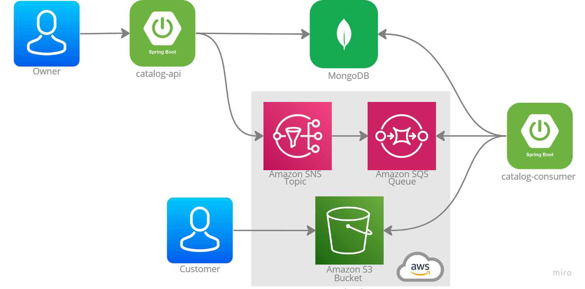

# Catalog Consumer

This document is available in [English](README-en.md), but it is also available in [Portuguese](README.md).


## Overview
This project is an implementation of the [AnotaAi Backend Challenge](https://github.com/githubanotaai/new-test-backend-nodejs). Essentially, 
the challenge involves creating an [API](https://github.com/lucsalm/catalog-api) capable of performing insertions and updates in an owner's 
catalog of products on MongoDB. It sends any changes to a notification topic in AWS SNS, which is connected
to an AWS SQS queue listened by another [application](https://github.com/lucsalm/catalog-consumer)  responsible for creating a JSON representation from the
MongoDB data. This application then inserts and updates a file in an AWS S3 bucket for quick querying.
 
## Stack


## Architecture



## How to Use

1. Configure services in your AWS account:
    1. Create a topic on SNS.
    2. Create a queue on SQS.
        - Subscribe the queue to the topic already created.
        - Give it the following permission:
           ```json 
            {
             "Sid": "{SID}",
             "Effect": "Allow",
             "Principal": "*",
             "Action": "sqs:SendMessage",
             "Resource": "arn:aws:sqs:{REGION}:{ACCOUNT_ID}:{QUEUE_NAME}",
             "Condition": {
               "ArnEquals": {
                 "aws:SourceArn": "arn:aws:sns:{REGION}:{ACCOUNT_ID}:{TOPIC_NAME}"
               }
             }
            }
            ```
    3. Create a bucket on S3.
        - Able the public access.
        - Give it the follow permission:
            ```json
            {
             "Sid": "{SID}",
             "Effect": "Allow",
             "Principal": "*",
             "Action": "s3:GetObject",
             "Resource": "arn:aws:s3:::{BUCKET_NAME}/*.json"
            }
            ```
    4. Create a user on IAM:
        - Give it the following policies:
        ```yaml
        AmazonS3FullAccess
        AmazonSQSFullAccess
        AWSIoTDeviceDefenderPublishFindingsToSNSMitigationAction
       ```
        - Create an Access Key Credentials.
   
2. Make sure Docker is installed in your machine.
3. Clone this repository to your local environment.
4. Set your AWS environments in [docker-compose.yaml](docker-compose.yaml) file:
   ```yaml
     AWS_REGION
     AWS_SNS_TOPIC_ARN
     AWS_S3_BUCKET_NAME
     AWS_SQS_NAME
     AWS_CREDENTIALS_KEY_ACCESS
     AWS_CREDENTIALS_KEY_SECRET
      ```
5. In the terminal, execute the following command to build and start the Docker container:
    - On Linux, run:
        ```bash
        docker compose up
        ```

    - On Windows, run:
        ```bash
        docker-compose up
        ```

6. After the containers are built and the application is started,
   access [Swagger](http://localhost:8080/swagger-ui/index.html) to view its documentation. You should see the following
   screen:

**Notes:**

- Ensure that ports `8080` and `8081` are not being used by another application on your system to avoid
  conflicts. If necessary, you can modify the port mapping in the [docker-compose.yaml](docker-compose.yaml) file.